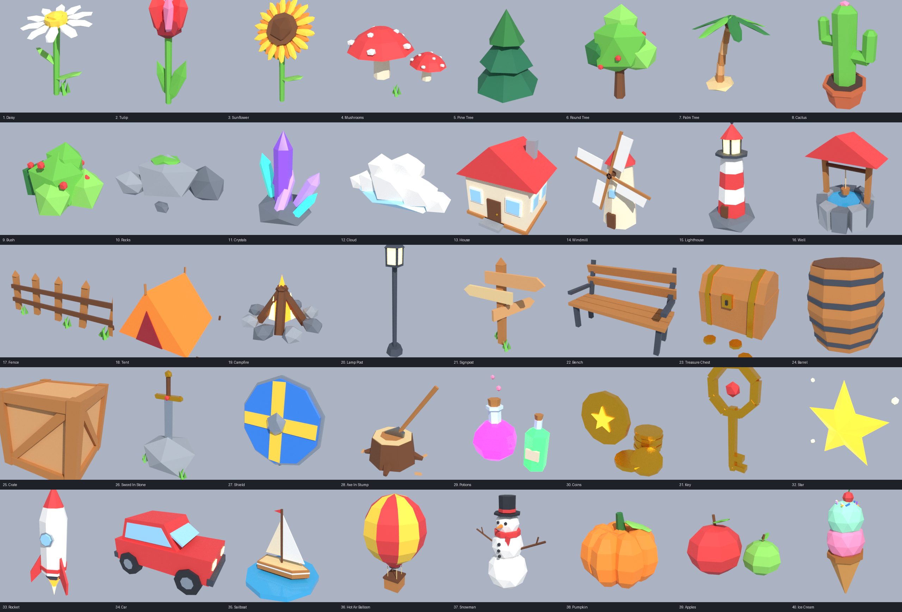

# Low Poly Pack — 40 models for Blender

**Files**
- `lowpoly_pack.blend`: open it in Blender and all 40 models are there.
- `lowpoly_pack.glb`: the same models for Unity, Godot, Unreal, or three.js.
- `lowpoly_pack.py`: the script that builds them. In Blender go to **Scripting → Open → Run Script**.
  Change the numbers in any model function and run it again to make your own versions.

**Models:** Daisy, Tulip, Sunflower, Mushrooms, Pine Tree, Round Tree, Palm Tree, Cactus, Bush, Rocks,
Crystals, Cloud, House, Windmill, Lighthouse, Well, Fence, Tent, Campfire, Lamp Post, Signpost, Bench,
Treasure Chest, Barrel, Crate, Sword In Stone, Shield, Axe In Stump, Potions, Coins, Key, Star,
Rocket, Car, Sailboat, Hot Air Balloon, Snowman, Pumpkin, Apples, Ice Cream.

Each model is one object with flat shading and its origin at the bottom. They share a small set of `LP_*` colour materials.
